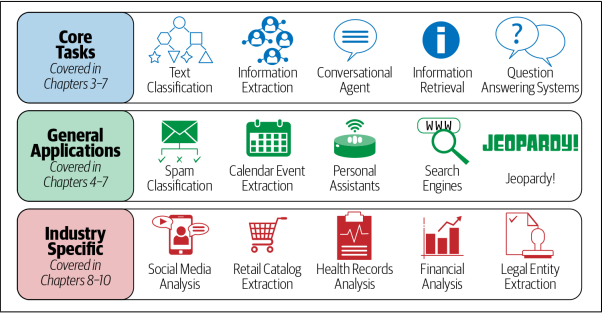
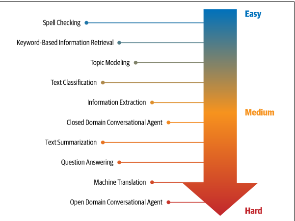
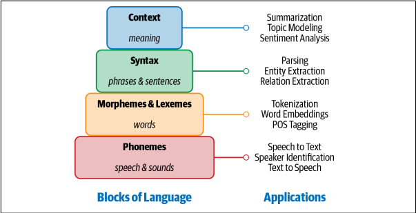
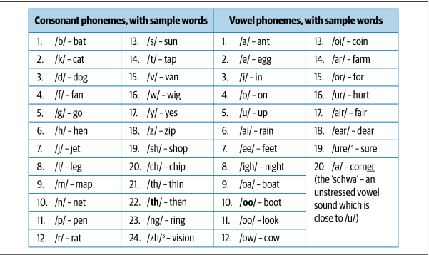
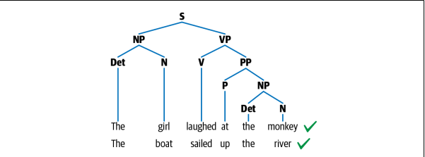

# Chapter 1 - NLP: A Primer

**NLP task and application**

## 1. NLP Tasks

- Language modeling
- Text classification
- Information extraction
- Information retrieval
- Conversation agent
- Text summarization
- Question answering
- Machine translation
- Topic modeling

## 2. What is language ?

### Building Blocks of Language

- **Phonemes**

Phonemes of English example:

- **Morphemes and lexemes**

Morphemes example:

- **Syntax**

Syntax parse tree example: 

- NP: Noun phrase
- VP: Verb phrase

- N: Noun
- V: Verb
- P: Position

- **Context**

## 3. Machine Learning, Deep learning, and NLP overview

### Machine Learning for NLP

- Naive Bayes
- Support vector machine
- Hidden Markove Model
- Conditional random fields

### Deep Learning for NLP

- Recurrent neural networks

- Long short-term memory

- Convolutional neural networks

- Transformers

- Autoencoders

### Why deep learning is not yet the silver bullet for NLP

- Overfitting on small datasets
- Few-shot learning and synthetic data generation
- Domain adaptation
- Interpretable models
- Common sense and world knowledge
- Cost
- On-device deployment

## 4. An NLP Walkthrough: Conversational Agents

